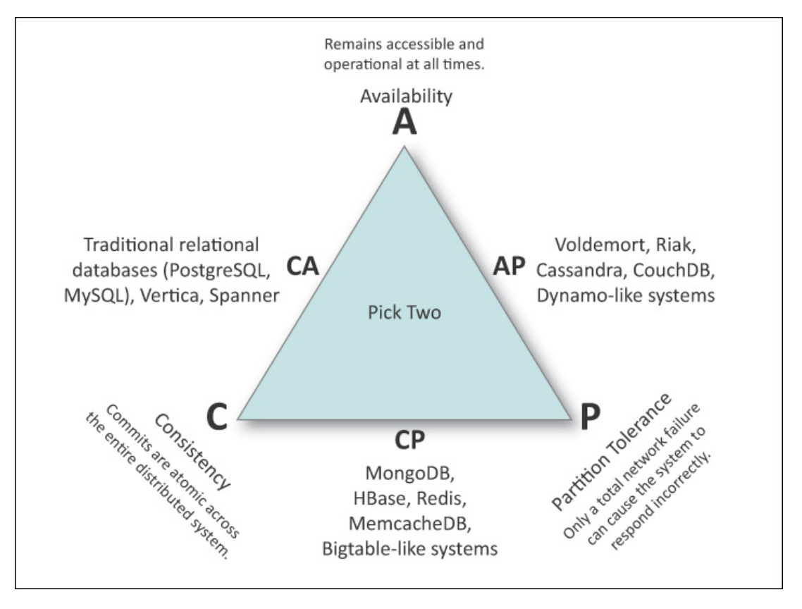
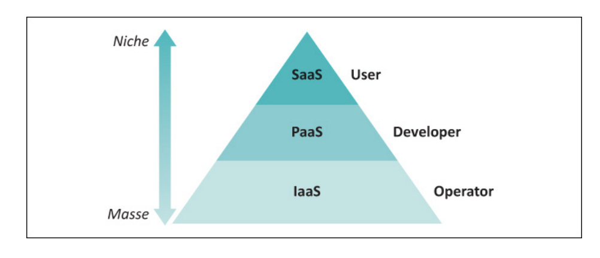
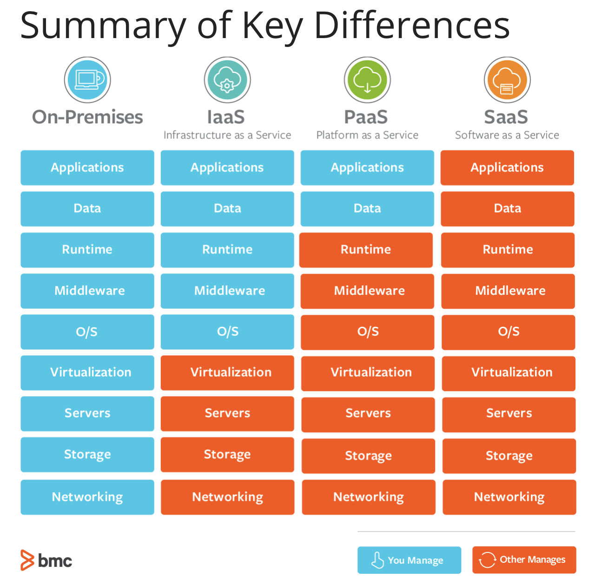

# Part I Design: Building It
Ideal System Architecture
- Accepts hardware and software failures but handling redundancy and resilience features that work around failures (Components fail but system survives)
  - Redundancy - defines deployment of duplicate devices of systems in critical areas over active operation
  - Resiliency - ability to recover after disruptive event
- Each subsystem that make up service is service
  - Subsystem is programmable via API
  - Each subservice is loosely coupled to others, so can be independently scaled, upgraded or replaced

## Distributed Systems
- **Load Balancer with Multiple Backend Replicas**:
  - Divides traffic among many duplicated systems.
  - **Algorithm**: Round-Robin, Least Load, Slow Start.
  - **Replicas**: Backends are all equivalent “clones”.
  - **Health Checks**: load balancer must always know which backends are alive and ready to accept requests.
  - **Round-Robin**: Alternate in sequence. Simple, but what if some backends have > CPU/ RAM?
  - **Least Load**: Need to track how “busy” a backend is, then select “least load”. (Connections, CPU,
Trailing Avg. / Last 5mins.)
  - **Slow Start**: Never send more than a certain number of requests to the same machine in a row.
- **Frontend with Multiple Backends**:
  - Uses different backends in parallel with each performing different processes
  - Server receives request, sends queries to many backend servers, and composes the final reply by combining those answers
    - Used when query can be deconstructed to independent queries
- **Server Tree**
  - Number of servers work cooperatively with one as the root of tree, parent servers below, and leaf servers at the bottom of tree
    - Typically used to access a large dataset or corpus Corpus is larger than any one machine can hold, thus each leaf stores a shard
  - Need access to more data than a server can hold, so split to shards which each server contains

## CAP Principle
- Consistency, Availability, Partition Tolerance
- States that a distributed system can only achieve at most 2
- SQL = ACID (Atomicity, Consistency, Isolation, Durability)
- NoSQL = BASE (Basically Available soft-state services eventual consistency)

- **Consistency**: all nodes see the same data at a given time
- **Available**: every request receives a response, whether it is successful or failed (i.e. system is up), achieved through replicas
- **Partition tolerance**: means the system continues to operate despite arbitrary message loss or failure of part of the system. Loss of network within a cluster, but still continues to operate (i.e. nodes are up, but can't communicate). (Partition = communication break)

# Design for Operations
- Infrastructure as Code
  - Configuration:
    - Deployment automation, backup/restore, version control
  - Startup/Shutdown:
    - Self-healing, crash resilience
  - Queue Draining:
    - Gracefully taking a service down. Drain: Stop new transactions but let current ones finish
  - Software Upgrades:
    - Upgrades without down time. Rolling upgrades, gradual evolution.
  - Backups and Restores
  - Replicated Databases:
    - DB scaling via read replicas
- Serviceability
  - Hot Swaps:
    - Should be able to swap service in/out without downtime (i.e. via logic or integration with load balancers)
  - Startup / shutdowns
  - Feature Toggles:
    - Ability to enable/disable feature from users. Allows for partial rollout with feature "off"
  - Graceful Degradation:
    - Software built to expect and respond to down or degraded backend services
  - Access control and rate limits
    - API to control access and enforce usage throttling via limits.
  - Data Import
    - Ability for admins to manage data to accept.
- Manageability
  - Monitoring
  - Auditing
  - Debug Instrumentation
  - Exception Collection
  - Documentation for Operations

## Requirements for Operations
- Mature DevOps: Design & built these features from the get go.
- Build as you Go: DevOps teams incrementally add features
- Ops Only Code: Dev refuses to add Ops features, so Ops folks goes it alone
- Out-Source: Work with 3rd-Party Developers

# Selecting a Service Platform
- Infrastructure as Code (IaaS)
  - Computer and network hardware, real or virtual, ready for you to use
- Platform as a Service (Paas)
  - Your software running in a vendor-provided framework or stack
- Software as a Service (Saas)
  - An application provided as a website

## Cloud Machine Types
- Physical, Virtual, Containers
- OS allows concurrent programs to use shared resources via multiprocessing & context switching.

# Application Architectures
- Three-tier web service architecture:
  - Load balancer, web server replicas, data server
- Four-tier web service architecture
  - Load balancer, frontend web, app server, data server

## Load Balancer Types
- DNS Round Robin
  - Listing IP addresses of all replicas in the DNS entry for th ename of the web server.
  - Rarely used, because doesn't work very well and is difficult to control and not very responsive.
- Layer 3 and Layer 4 Load Balancers (L3 & L4)
  - Receive each session TCP session and redirect it to one of the replicas
  - Layer 3 is the network (IP) layer
  - Layer 4 is the session (TCP) layer
  - L3 Load balancers
    - track TCP sessions based on source and destination IP addresses (i.e., the network layer)
    - All traffic from a given source address will be sent to the same server regardless of the number of TCP sessions it has generated.
  - L4 load balancers
    - track source and destination ports in addition to IP addresses (i.e. the session layer)
  - Benefits: simple and fast and handles replica failure
- Layer 7 Load Balancer
  - work similarly to L3/L4 load balancers but make decisions based on what can be seen by peering into the application layer (Layer 7) of the protocol stack
  - can examine what is inside the HTTP protocol itself (cookies, headers, URLs, and so on) and make decisions based on what was found
  - Offer richer mix of features than the previous load balancers
    - Ex. L7 load balancer can check whether a cookie has been set and send traffic to a different set of servers based on that criterion (route important customers to log in on FAST servers)
- Important Notes: IP addresses of requests are opaque, backend only sees a single source: the load balancer.

## Load Balancing Methods
- **Round Robin**: machines are rotated in a loop (rotation: A-B-C-A-B-C), down machines are skipped
- **Weighted RR**: similar to RR, but gives more queries to the backends with more capacity (C is 2x as big, so handle 2x the load; rotation --> A-C-B-C)
- **Lead Loaded**: Load balancer receives information from each backend indicating how loaded it is. Incoming requests always go to the lead loaded backend.
- **Lead Loaded with Slow Start**: Similar to LL, but when a new backend comes online it is not immediately flooded with queries (receives a low rate of traffic that slowly builds until it is receiving an appropriate amount of traffic)
- **Utilization Limit**: Each server estimates how many more QPS it can handle and communicates this to the load balancer
- **Latency**: Load balancer stops forwarding requests to a backend based on the latency of recent requests (ex. requests are taking more than 100 ms, the load balancer assumes this backend is overloaded)
- **Cascade**: The first replica receives all requests until it is at capacity. Any overflow is directed to the next replica and so on. Load balancer must know how much each replica can handle (static config based on synthetic load tests)

## Load Balancing with Shared State
- **Sticky Connections**:
  - all a user's requests route to the same backend
  - Problem: if backend dies, load balancer will route user to another backend
- **Shared State**:
  - Use database meant for shared state storage in RAM for fast access (Redis, Memcached) to store and retrieve shared state (user is currently logged in and has X profile)
- **Hybrid**:
  - When a user state moves from one backend to another, creates extra work for the web server

## User Identity Issue
- Problem: IP addresses change often, so backends cant use source IP address of HTTP request to track
- Solution:
  - Using **cookies** (scheme) and secrets (**session ID**)
  - Ex. User logs into a web application, web application generates a secret and includes it with the reply (generated randomly and given to only user on that web browser)
- This goal is usually achieved by having some kind of server that stores state common to all replicas.

## Scaling
- Three tier solution advantages
  - More flexible, expandable with replicas, each service can be grown independently
- Variations:
  - **Replica Groups**: Load balancers can serve many groups of replicas not just one (e.g. each group serves a different website and can be grown independently)
  - **Dual load balancers**: There can be multiple load balancers, each a replica of each other. If one fails, other takes over.
  - **Multiple Data Stores**: Many different data stores (each replica group has their own data store or shared data store)

## Reverse Proxy Service
- A reverse proxy enables one web server to provide content from another web server transparently. The user sees one cohesive web site, even though it is actually made up of a patchwork of applications.
- /, /sports, /weather, /finance, all provided by a very different web service, but combined into a seamlessly unified user experience by a reverse proxy.
- requests go to the reverse proxy, which interprets the URL and collects the required pages from the appropriate server or service.
- Like the frontend four-tier web service, this scheme permits centralizing security and other services. Having many applications behind one domain simplifies many administrative tasks, such as maintaining per-domain crypto certificates.
- Diff between front-end web service and reverse proxy is that reverse proxy is simpler and usually just connects the web browsers and the patchwork of HTTP servers that sit behind it.

## Cloud-Scale Service
- globally distributed and service infrastructure uses one of the previously discussed architectures (4-tier web service), and replicated to many places around the world
  - Gobal Load Balancer examines source IP address of the query, and returns a different result depending on geolocation of source IP

## Message Bus Architectures
- Many to many communication mechanism between servers
- Convenient way to distribute information among different services
- More efficient than repeatedly polling a database to see if new information has arrived
- Message bus is mechanism whereby servers send messages to "channels" and other servers listen to the channels they need.
  - Server sending message = **publisher**, receivers = **suscribers**
- Permits one-to-many, many-to-many, or many-to-one communication.
- Efficient in that clients receive a message only if they are subscribed
- As systems get larger, message bus architectures become more appealing because they are fast, they are efficient, and they push control and operational responsibility to the listeners.

## Service-Oriented Architecture
- Enables large services to be managed more easily
- Each subsystem is a self-contained service, providing its functionality as a consumable service via an API.
  - Various services communicate with one another by making API calls
- **GOAL**: services be loosely coupled
- Advantages: Flexible, easily supported, independently scale each service
- Best Practices of SOA:
  - Use same underlying RPC protocol to implement the APIs on all services.
  - Consistent monitoring mechanism (services should expose measurements to the montoring system the same way)
  - Use same techniques with each service as much as possible. (same load balancing system, management techniques, coding standards)
  - Adopt some form of API governance (maintain standards for how they work)

# Design Patterns for Scaling
- AKF Scaling Cube
  - Replicate entire system (horizontal)
  - Split system into individual functions (functional / service splits)
  - split the system into individual chunks (lookup or formulaic splits)

## Horizontal Duplication (X Axis)
- Increases throughput by replicating the service (scaling out)
- Does not scale well with increases in data or with complex transactions that require special handling
- If transactions require replicas to communicate (i.e. not independent), the scaling is less efficient.
- Techniques
  - Adding more machines / replicas
  - Adding more disk spindles
  - Adding more network Connections

## Functional / Service Splits (Y Axis)
- Scaling a system by splitting out each individual function so that it can be allocated additional resources
- Separation of services to different machines (web server, database, application server)
- Techniques:
  - Splitting by function, with each function on its own machine oor on its own pool of machines
  - Splitting by transaction Types
  - Splitting by type of user

## Lookup-Oriented SPlit (Z Axis)
- Scales a system by **splitting the data** into identifiable segments, each of which it is given dedicated resources.
- Similar to Y axis, but divides data instead of processing
- EX. Divide/Segment a database by date or geography
- Only undertaken when scaling on x and y axis is exhausted
- Ways to Segment Data:
  - By Hash Prefix: sharding
  - By customer functionality
  - By Utilization
  - By organizational division

## Caching
- small datastore using fast/expensive media, intended to improve slow/cheap bigger data store
- **Optimization of the Z-Axis**
- Look up -> first cache, if not found, normal look up is done from disk

## Data Sharding
- Way to segment a database (Z-Axis) that is flexible, scalable, and resilient
- Divides DB based on the hash value of the database keys
- Ex. Divide DB into two shards:
  - Generate hash of key and store keys with even hashes in one DB, and keys with odd hashes in other DB
  - Distributed Hash Table (DHT)

## Threading (Concurrency)
- DAta can be processed in different ways to achieve better scaled
- Threading = used to improve systme throughput by processing many requests at the same time
- Threading is a technique used by modern operating systems to allow
sequences of instructions to execute independently. Threads are subsets of processes; it’s typically faster to switch operations among threads than among
processes. We use threading to get a fine granularity of control over processing for use in complex algorithms
- Throughput is improved because
requests are processed in parallel, multiple CPUs are utilized, and head of line blocking is reduced or eliminated.
